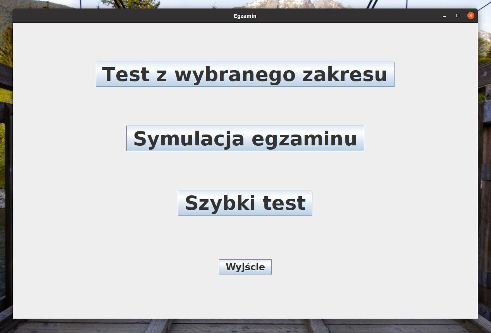
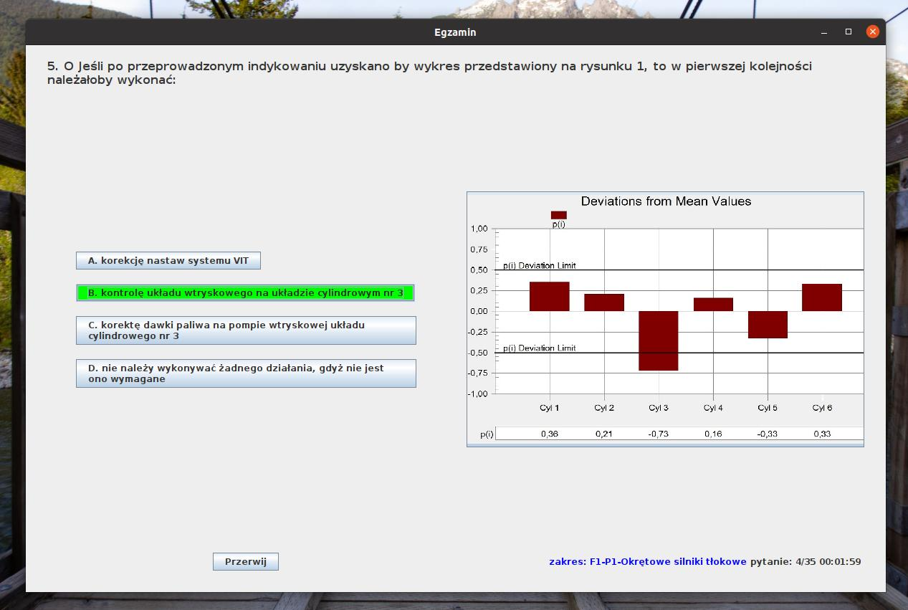
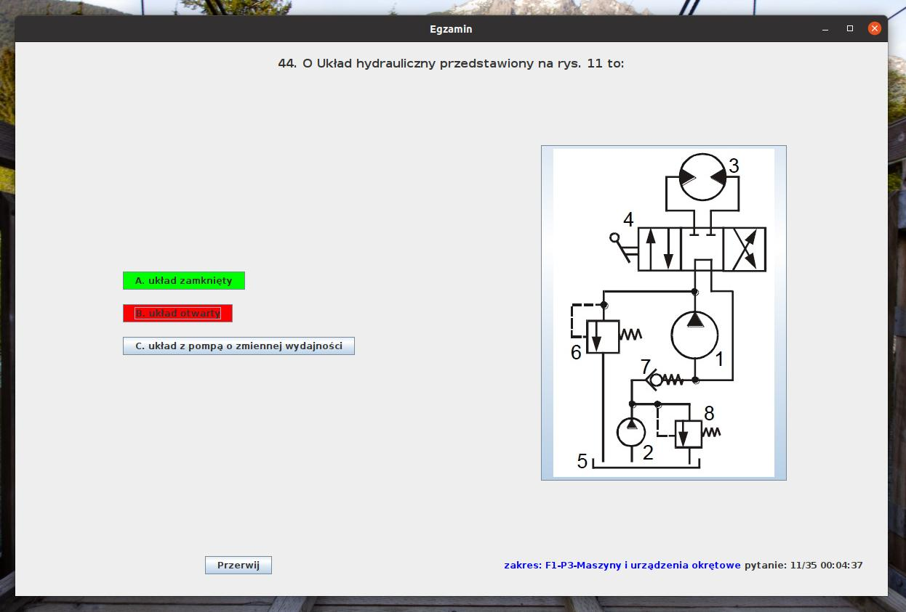
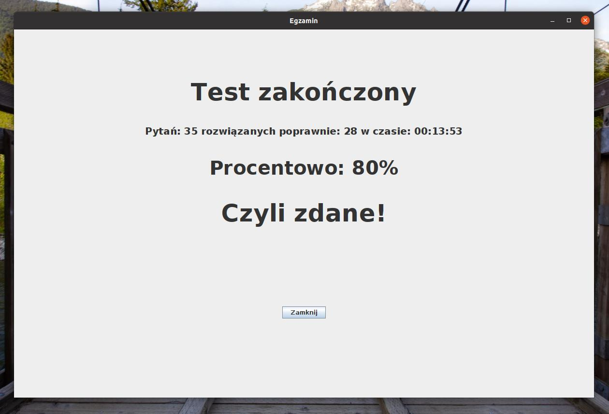

# Część testowa egzaminu na 2 mechanika

Program pomaga w przygotowaniu do części testowej egzaminu państwowego na dyplom 2 oficera mechanika.
Zawiera wszystkie pytania udostępnione na stronie komisji egzaminacyjnej (stan z roku 2018).

Po zaznaczeniu odpowiedzi pokazuje poprawną opcję, po zakończeniu testu wyświetla wynik.

